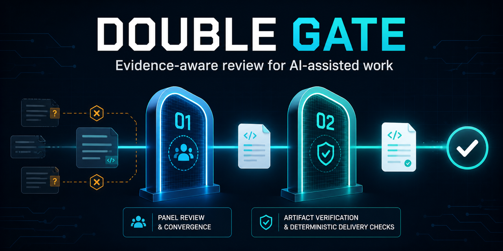

# Review claims should come with inspectable evidence

Double Gate is an open-source Python CLI and library for reviewing AI and agent
outputs. It separates two questions that are often blurred together:

1. **What did the review panel actually conclude?**
2. **Do the cited artifacts and delivery conditions support shipping?**

[View the source](https://github.com/luohechentim/east-west-gate) ·
[Download v0.3.1](https://github.com/luohechentim/east-west-gate/releases/tag/v0.3.1) ·
[Join the discussion](https://github.com/luohechentim/east-west-gate/discussions)

## Try it in three minutes

```bash
git clone https://github.com/luohechentim/east-west-gate.git
cd east-west-gate
python -m pip install -e ".[dev]"
python examples/demo_offline.py
```

Then review a proposal, report, or code-change description:

```bash
double-gate review proposal.md --risk low --offline --root .
double-gate gates proposal.md \
  --risk low \
  --context examples/gates-context.json \
  --fail-on-failure
```

The CLI writes structured JSON suitable for local inspection and CI workflows.

## The two gates

```text
proposal / report / code change
        │
        ├─ Gate 1: panel review + convergence adjudication
        ├─ Gate 2: cited-artifact guard + six delivery gates
        └─ repair checklist → re-review → human release decision
```

### Gate 1: establish the review record

- dispatch blind reviewer seats and preserve failed seats;
- parse structured findings;
- distinguish unanimous, majority, split, and single-reviewer signals;
- record whether reviewers are genuinely independent providers.

### Gate 2: verify the delivery boundary

- check reviewer-cited files, APIs, imports, symbols, and fields inside an
  approved repository root;
- run deterministic task, data, review, bias, output, and delivery gates;
- turn findings into a repair checklist;
- distinguish “not mentioned again” from “resolved with adequate evidence.”

## Designed for honest limitations

The built-in offline panel is a deterministic **simulation** for development and
CI smoke tests. It is labeled `offline-simulation` and cannot produce automatic
delivery-ready assurance.

A real multi-provider panel adds review evidence for human judgment. It does not
prove that an output is correct. The artifact guard establishes bounded existence
evidence for cited artifacts; it does not validate every factual or behavioral
claim.

## Where it fits

Double Gate is useful when teams need machine-readable review evidence around:

- AI-assisted code and design changes;
- reports whose reviewers cite repository artifacts;
- agent-generated deliverables entering CI;
- repair loops that require explicit re-review evidence;
- release decisions that must remain human-owned.

## Project links

- [Documentation and examples](https://github.com/luohechentim/east-west-gate#readme)
- [Configuration guide](https://github.com/luohechentim/east-west-gate/blob/main/docs/CONFIGURATION.md)
- [Security policy](https://github.com/luohechentim/east-west-gate/blob/main/SECURITY.md)
- [v0.3.1 release](https://github.com/luohechentim/east-west-gate/releases/tag/v0.3.1)
- [Contributing](https://github.com/luohechentim/east-west-gate/blob/main/CONTRIBUTING.md)
